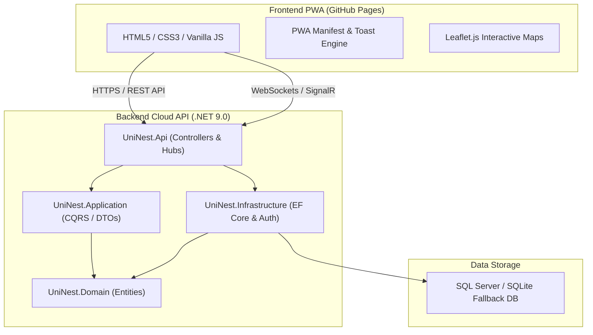

# 🏠 UniNest - Full-Stack Student Housing Platform

[](https://dotnet.microsoft.com/)
[](https://opensource.org/licenses/MIT)
[](https://foxelhadad812-design.github.io/uninest/)
[](http://uninest-api.runasp.net/swagger)

**UniNest** is an enterprise-grade, full-stack student housing platform built with **.NET 9.0 Web API (Clean Architecture)** and a responsive **Progressive Web App (PWA)** frontend. Designed specifically to help Egyptian university students find, compare, and reserve verified housing safely and conveniently.

---

## 🚀 Live Demo Links

| Layer | URL | Description |
| :--- | :--- | :--- |
| **🌐 Frontend (GitHub Pages)** | [https://foxelhadad812-design.github.io/uninest/](https://foxelhadad812-design.github.io/uninest/) | Live PWA web application |
| **⚡ Backend API (RunASP Host)** | [http://uninest-api.runasp.net/api/v1/listings](http://uninest-api.runasp.net/api/v1/listings) | Live .NET 9.0 REST API |
| **📑 API Documentation (Swagger)** | [http://uninest-api.runasp.net/swagger](http://uninest-api.runasp.net/swagger) | Interactive Swagger UI |

---

## 📸 Platform Highlights & Screenshots


### 🌟 Key Features
- **🔍 Debounced Instant Live Search & Filtering:** Filter student apartments by city (Fayoum, Cairo, Giza, Alexandria, Mansoura), max rent, room type (Apartment, Single, Shared), and gender policy.
- **🗺️ Interactive Leaflet.js Maps:** Free, open-source location map with property pins, university proximity indicators, and custom popup previews.
- **⭐ Student Reviews & Star Ratings System:** Real-time rating breakdowns, student feedback, and review submission.
- **⚖️ Side-by-Side Property Comparison:** Compare up to 3 listings simultaneously (Price, Rooms, Beds, Gender Policy, Amenities).
- **📱 PWA & Mobile Installable:** `manifest.json` integrated with app icons, offline caching, and native mobile shortcuts.
- **🔐 JWT Authentication & Security:** Identity password hashing, JWT bearer tokens, role-based authorization (`Student`, `Owner`, `Admin`), and XSS/CORS protection.
- **💬 Real-Time SignalR Chat:** Instant student-landlord messaging over open housing inquiries (`ws://uninest-api.runasp.net/hubs/chat`).
- **🏠 Owner Portal Dashboard:** Dedicated landlord dashboard to manage active properties and submit new housing listings.

---

## 🏛️ System Architecture & Tech Stack



### 🛠️ Backend Stack
- **Framework:** .NET 9.0 Web API (`C# 13`)
- **Architecture:** Clean Architecture (Domain, Application, Infrastructure, Api)
- **Database:** Entity Framework Core (MSSQL Server + Dual SQLite `uninest.db` fallback)
- **Security:** ASP.NET Core Identity (PBKDF2 Password Hashing), JWT Bearer Tokens, Rate Limiting, CORS origin scoping
- **Documentation:** Swagger UI / OpenAPI 3.0

### 🎨 Frontend Stack
- **Languages:** HTML5, Modern Vanilla JavaScript (ES6+), CSS3 (Custom Variables, Grid, Flexbox)
- **Maps Engine:** Leaflet.js + OpenStreetMap (100% Free & Open Source)
- **Real-Time Client:** Microsoft SignalR JS Client
- **UI Engine:** Custom Skeleton Shimmer Loaders, Toast Notification Engine (`js/toast.js`), i18n English/Arabic Translation Engine (`js/lang.js`)

---

## 🔐 Security & Best Practices

- **Zero Hardcoded Secrets:** Connection strings, JWT secret keys, and passwords are read dynamically from Environment Variables or User Secrets.
- **Secure Password Hashing:** Uses ASP.NET Core Identity's default PBKDF2 with SHA-256 and automatic salt generation.
- **Database Provider-Neutral:** Custom EF Core `ConfigureConventions` ensures `DateTimeOffset` and Guid types format seamlessly on both SQL Server and SQLite.
- **Strict CORS & Rate Limiting:** API requests are rate-limited to 120 req/min per IP, with CORS restricted strictly to GitHub Pages frontend origin.

---

## 📂 Repository Structure

```text
📦 UniNest
 ┣ 📂 src
 ┃ ┣ 📂 UniNest.Domain             # Core Entities, Enums, Auditable base classes
 ┃ ┣ 📂 UniNest.Application        # DTOs, Service Interfaces, Logic
 ┃ ┣ 📂 UniNest.Infrastructure     # DbContext, Identity, Migrations, Seeders
 ┃ ┗ 📂 UniNest.Api                # Controllers, SignalR Hubs, Swagger, Middleware
 ┣ 📂 tests
 ┃ ┣ 📂 UniNest.UnitTests          # xUnit Domain & Application Unit Tests
 ┃ ┗ 📂 UniNest.IntegrationTests   # WebApplicationFactory Integration Tests
 ┣ 📂 css                          # Stylesheet & Shimmer animations
 ┣ 📂 js                           # PWA, API Client, Maps, Toast & Filter scripts
 ┣ 📜 index.html                   # Landing page
 ┣ 📜 listings.html                # Listings discovery & map view
 ┣ 📜 details.html                 # Property details, reviews & booking
 ┣ 📜 profile.html                 # User profile & Owner Dashboard
 ┗ 📜 manifest.json                # PWA Manifest configuration
```

---

## 👨‍💻 Developer & Portfolio Links

- **GitHub Repository:** [https://github.com/foxelhadad812-design/UniNest](https://github.com/foxelhadad812-design/UniNest)
- **Live Frontend Application:** [https://foxelhadad812-design.github.io/uninest/](https://foxelhadad812-design.github.io/uninest/)
- **Live Swagger API Docs:** [http://uninest-api.runasp.net/swagger](http://uninest-api.runasp.net/swagger)

---

> *Developed with ❤️ for Egyptian University Students.*
